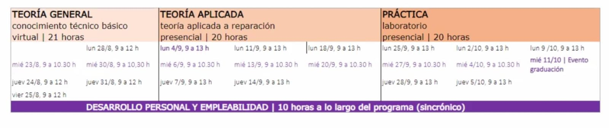

# Samsung Tech School 2023 Primera Impresión
En esta serie de posteos les voy a contar mi experiencia
a dentro del programa **Samsung Tech School 2023 Heladeras y Lavarropas**. Es un programa de formación profesional teórico-práctico orientado a la **reparación de celulares y de productos de línea blanca** de la marca Samsung.

## ¿De qué se trata el programa?
El programa tiene una modalidad híbrida (virtual y presencial) con una duración de 70 horas distribuidas en 4 ejes:
1. **Teoría general** (conocimiento técnico básico virtual)
2. **Teoría aplicada** (en reparación presencial)
3. **Práctica / Laboratorio** (presencial)
4. **Empleabilidad y desarrollo** personal(sincronico)

Está destinado a **estudiantes seleccionados** de entre 17 y 19 años que estén cursando el último año del colegio técnico en la especialidad de electrónica, se le da una beca a ciertas escuelas de la Ciudad de Buenos Aires y Cañuelas.

## La Oportunidad
La noticia me llegó una semana antes de que el programa empiece y mis **ganas de saber** que me iba a encontrar en el primer zoom informativo eran enormes. **Contexto**: Un dia normal en aula de Practicas Profecionalizanes nos enteramos de que al colegio habían llegado dos becas para que alumnos puedan ir a Samsung, la primera se la dieron a mi compañera que iba a estar yendo a **Reparacion de Celulares** y la otra a mi que iba a estar yendo a **Reparacion de Heladeras y Lavarropas**. En lo personal la idea de no ir a *reparacion de celulares* no me disgusto, vos que estás leyendo me dirás "pero Samsung, celulares, S22, A2000, Galaxy Ultra Pro", sigo pensando que es algo muy complejo en lo que se refiere **"poder implementarlo en casa"** debido a que se tienen que tener herramientas dedicadas a ese tipo de dispositivos.

**Arreglar un celular en casa no es nada fácil**, desde desarmarlo y tener una **máquina de calor** que te permite derretir el adhesivo que tiene la contratapa, siquiera poder ver un simple componente detallado, necesitarías un tipo de **microscopio** y ni hablar si necesitamos soldar o reemplazar un componente de su placa, para ese tipo de placas se requiere de una **soldadora especial de microsoldadura**.

Mi pensamiento siempre fue, yo en casa con un **simple destornillador** puedo desarmar la heladera y el lavarropas para ver todo lo que tiene por dentro, no necesitaría de máquinas especiales para hacer lo mínimo, ver.

Que nos llevasen a la **fábrica de Samsung** me volvía loco, según la poca información que tenía en ese momento íbamos a tener **clases teóricas y prácticas** sobre el funcionamiento de sus productos más importantes, íbamos a **recorrer la fábrica** y entender la **linea de produccion** Heladeras y Lavarropas.

Hasta ese momento **la propuesta prometía mucho** y las expectativas eran enormes, luego de que acepten mi solicitud de beca **siempre se mantuvieron en contacto conmigo** y las autoridades de mi colegio. Eso es algo que tengo que destacar, la gente de Junior Achievement en todo momento y para todo se comunicó conmigo personalmente por celular, para autorizaciones, datos, formularios y preguntas.

## Primera Encuentro con Samsung
El programa tuvo un miercoles 28/8 con un **zoom estilo informativo** que era parte del eje *empleabilidad y desarrollo*, donde se presentaron los representantes de **Samsung**, **Visuar**, **Junior Achievement**. y nos explicaron la dinámica de cómo serían las 3 Etapas principales.

- **Teoría General**
Las primeras dos semanas tendríamos zoom de teoría general de Heladeras y Lavarropas, cómo funcionan, cómo instalarlas, explicación teórica del funcionamiento de cada una de ellas.
- **Teoría Aplicada**
Para esta etapa iríamos al Parque Industrial Cañuelas, ahí 
repasariamos temas vistos en la *Teoría General*, los tocaremos más a fondo y empezamos hacer prácticas aplicadas sobre los electrodomésticos.
- **Práctica**
En esta etapa tendremos prácticas sobre soldadoras eléctricas, reparación de fugas, análisis de fallas.

**Mi experiencia** en esta primera parte que voy a llamar "Primera Impresión" **fue mejor de la que esperaba**, toda la seriedad que imaginaba con respecto al proyecto se vio reflejada en el primer encuentro, en todo momento recalcaron que se hacía para nuestra carrera profesional en el ámbito empresarial y técnico. **Se vieron las ganas de querer hacer esto con nosotros** y nos dieron una introducción a un campus virtual donde se subieron futuras actividades para nosotros.

En el **próximo articulo** subire como fue mi experiencia en la primera etapa [Teoria General](https://herediiaa.website/posts/samsung-tech-school-primera-etapa/) sobre Heladeras y Lavarropas.

