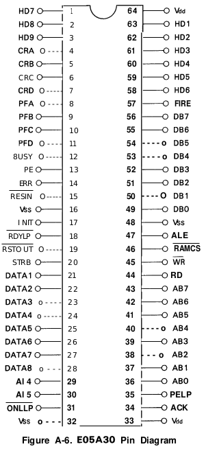

---
author: Emmanuel Heredia
pubDatetime: 2023-07-17T9:22:00Z
title: Impresora Braille Inicios
postSlug: adding-new-posts-in-astropaper-theme
featured: true
draft: false
tags:
  - proyectos
  - electronica
ogImage: ""
description:
    El inicio de uno de los proyectos mas importantes de mi vida, ayudar a las personas con discapacidad visual a ser mas incluidos y tener una comunicacion mas rapida mediante el papel y nuestra Impresora Braille
  

---  
En este artículo, compartiré los inicios de nuestro proyecto de Impresora Braille y cómo evolucionó con el tiempo.

## Table of contents

## Inicios del Proyecto  

Como estoy en el último año del colegio secundario técnico en la materia de Prácticas Profesionalizantes cómo requisito de aprobación nos piden tener varios proyectos a lo largo del año, en esta ocasión les voy a hablar de uno de ellos. **Nuestra impresora de Braille**, hablo en plural ya que este proyecto lo hice con el grupo que lideró y que son de gran ayuda.  
  
La idea fue de mi compañero Cesar Gonzalez y al principio nadie sabía o tenia una idea de como iba a ser la máquina, varias ideas rondaron por nuestras cabezas. El primer pensamiento que se me vino a mi fue hacer una especie de robot que caminara sobre la hoja y marcara los agujeros, si bien parecia una especie de locura ya teniamos conocimiento en el area por que habíamos hecho el año pasado un proyecto parecido.  
  
## Idea  
Al cabo de unas horas nos dimos cuenta que en el taller habian 3 impresoras viejas modelo **Epson LX-810**. Su sistema mecanico era idea para poder imprimir hojas, la cual es absorvida por un rodillo que la imprime de izquierda a derecha hasta que la hoja se queda sin lugar.  
  
Nuestra idea era esta: convertir una impresora llena de polvo del año **1991** a una funcional que tenga la caracteristica de que imprima en braille. La idea en lo personal me motivaba, salir de los proyectos convencionales como un regador automatico, un sistema de alarma de seguridad, un rover explorador, proyectos que con un simple arduino y un par de sensores se puede hacer. El desafio era ver como podiamos hacer todo lo posible para usar la placa original y ver como introducir nuestra logica y mecanismo de perforacion.  
  
  
## Estado de la Impresora  
El rumbo lo teniamos trazado, convertila en algo diferente, pero nos tocaba ver en que condiciones estaba esa impresora. Modelo Epson LX-810, una maquina que fue la ultima en su generacion lanzada en  *1991*. Su estado en el taller era el siguiente:  
  
llena de polvo por dentro, con las guias del motor que se mueve en horizontal un poco oxidado, con muchos golpes en su carcasa.  

  
## Organizacion  
Si bien sabiamos que ibamos a usar la impresora nadie sabia siquiera como funcionaba, por lo que nos pusimos a descomponer la impresora, ver sus partes y buscar el manual tecnico.  
  
> Lo mejor que pueden hacer siempre es buscar el manual tecnico de cualquier dispositivo con el que esten trabajando, o la stylesheet del componente que quieran saber en profundidad  
  
luego de dias de busqueda logre encontralo, tuve que buscarlo en ingles, ese es un buen consejo cuando trabajan con cosas antiguas.  
  
  
EL manual me dio una idea general de como funcionaba y que hacia cada parte, luego de varias dias de **leerlo y analizar** con mi grupo llegue a la conclusion de que existen estas fases en su funcionamiento:  
  
- **Etapa de Potencia**  
- **Interfaz de Usuario**  
- **Logica Circuital**  
- **Mecanica de Impresion**  
  
Sabiendo como funciona la impresora y teniendo en cuenta sus partes importantes me tocaba decidir que fases iba a tener mi impresora de braille por lo que me base en las fases anteriores y llegue a esta conclusion:  

- **Etapa de Potencia**  
- **Interfaz de Usuario**  
- **Logica Circuital**  
- **Mecanica de Impresion**  
 
Sí, eran las mismas fases, pero con modificaciones en la infraestructura y la mecánica para lograr el objetivo deseado: permitiria que las personas con discapacidad puedan leer la hoja con sus dedos.
  
## Funcionamiento  
Nuestra idea desde el principio era hacer una **placa shield** que se acomple a una placa arduino que maneje el sistema mecanico de la impresora y maneje los motores que serian alimentados desde  
una **etapa de potencia realizada por nosotros**, que alimentaria a la interfaz de usuario y al arduino tambien.  

> basicamente teniamos que hacer todo, desde diseñar la placa y construirla con los drivers y componentes necesarios hasta comprar transformadores que nos permitan alimentar el mismos arduino y motores con varios step-down
  

Nuestros profesores nos dijeron que mejor podiamos investigar y ver como **podiamos reutilizar la placa de la Epson LX-810**. Eso me motivo muchisimo mas, por lo que dentro del manual me puse a ver como estaba dividida la placa y entender todos sus componentes.  
  
  
A esta placa la podemos dividir en secciones y cada una tiene un funcionamiento especifico y controla cada fase de las que hablamos anteriormente.  
  
### Etapa de Potencia  
Una etapa de potencia se refiere a la etapa fundamental del circuito electrico que controla la entrega de energia desde la fuente de alimentacion hasta el componente o sistema, En la mayoria de los casos la etapa de potencia convierte la energía eléctrica de entrada (como corriente alterna) en una forma de energía que sea adecuada para alimentar dispositivos electrónicos. Esto puede implicar la conversión de CA a CC y la regulación de voltaje y corriente.  
  

  
En nuestra impresora la etapa de potencia tiene este diagrama que vamos a ir explicando paso por paso.  
  
Basicamente la corriente requerida para que la **"TAMA BOARD"** que es el nombre de la placa de la Impresora Epson, pueda funcionar correctamente primero pasa por una **Unidad de Filtro** donde se le quita el ruido y luego pasa por el **Transformador** donde se separa en dos tensiones: **AC 26** y **AC 12**. La salida del transformador esta conectada a la placa donde se mandan las tensiones a los circuitos de potencia que la convierte en **DC** para las siguientes operaciones que realiza la TAMA BOARD. El **Rectificador de Onda Completa** es un circuito electrónico utilizado para convertir una señal de corriente alterna (AC) en una señal de corriente continua (DC). Su función principal es tomar una señal de CA que oscila en ambas direcciones (positiva y negativa) y convertirla en una señal de DC que fluye en una sola dirección.  
  
  
  
  
  
Por lo que nuestra tension es convertida en continua mediate este dispositivo y regulada por un switching para entregar **+24V DC**  
foto  
  
EL **Rectificador de Media Onda** es un circuito que convierte una señal de corriente alterna (AC) en una señal de corriente continua (DC) aprovechando solo la mitad de la señal de AC. En otras palabras, rectifica solo una de las semiondas de la señal de AC, ya sea la semionda positiva o la semionda negativa, dependiendo de la configuración del rectificador.  
![enter image description here](data:image/png;base64,iVBORw0KGgoAAAANSUhEUgAAANMAAACJCAMAAACBzP16AAAADFBMVEX///8ICAgIhggAAAC0Hxo3AAAC9klEQVR4nO2bgXqrIAxGTfv+77xNEQIGNZAoZDn3+2an9A+nMAu73bI4juM41oC3O6CAXacv+jo/Bp0AkpQRJdNOv0JWlEqnrwWx6LTPvvmlYP23YtHpDxNO5TrCxM+T4bWRLdxpDtxpDtxpDtxpDv6L0yegU1E3/Q/C6fPRLKubvnJ0itVUyuqmb5RO+AWUfzF103cKp7yQdFnd9MjR6eTbXnTTI7nToYpoWd30ROl07IdcLd30ROZElZArq5uOsO5EF5Aqq5uOMe5Ui5cpq5ueYdupHi5RVjc9x7TTyXu6wNu9bnoBcqo3knDSTC+w7HQe3FtWNz0Q/8vTsNNVbF9Z3fQdc04QWB8/UfUVp+vQnrK66ZFi7rkTl1ec7kS2l9VNJ7DqdC+wtaxuOoU7teBOEsD9uLayuukk7tSAO4kAjLCWsrrpNO7Ez3cnGSZ1Ov34DXCi+FJa6QadIP39AnV1SieL4+ROYlX5z3Cns4usbnKleO1ZUqf3Pa2q/PZSKwl3cid3ut/67P6wXmdW5SKeHqzIBR+0wHcST8+fQo8T54UchrrPevXBnkhx+fP0TDcexZ3mwJ3mwJ3mwJ3mwJ3mwJ3mwJ3mwJ36Aqp7U+EXlhdHbJkvA+LHbvFnins6cQkrjurVPafzli86wX6AMI3CrzrQ6MGCTqyH0GRJD5bsWceMl5wgqOGT2wFNMnwFzz1UkszopnGcav0B9GVqJ/Tbtu3UduLCCTXKM7oRcDq81JWhy53qGd003fdQRyAeshbXcy9/Ms7opun9CU0YdEhx+L639TV7f4p3OjrjYac5cKc5sOjkGKc2aW9N5htr9ReodgbudBSIR69T7wpvnEaSCpsN2HcX+V4ondkah7PkhmkYp7D83tc95Todt0rLP8gaoStjkK1L7zrljbKYESidir3QQuypDuKjTT5qnLLNBDEateEa2SltguJQZY1rm65RnJBPnEhL2gulh1vjeDckNkzDKAn2ZBwnm3tSmc4MpeQ4XH4A3rgIVVb4p6UAAAAASUVORK5CYII=)  
De esta manera convierte los **AC 12V** a **DC 12V**  
  
**Circuito Regulador 5V** esta tension es generada por el step-down que aplica el capacitor Q6 al circuito de potencia de los 24V.  

  
De esta manera es como la etapa de la impresora trabaja, un poco compleja de analizarla si no ponemos a ver la placa desde arriba y tratamos de entender que hace cada capacitor o resistencia, yo no quise explicar mucho en profundid que hace cada componente de la etapa de potencia pero si una vista mas general.  
  
### Interfaz de Usuario  
La interfaz de usuario se refiere a la manera que tenemos de interactual con el dispositivo, en el caso de la Epson LX-810 tiene un pequeno apartado en la parte inferior donde se encuentran botones para hacerla funcionar y configuraciones.  

  
Como podemos ver tiene un sensor de *Ready* y *Paper Out* de estos sensores hablaremos mas tarde pero son importantes.  
  

  
### Logica Circuital  
  
Los **microcontroladores** son dispositivos embebidos diseñados para controlar y gestionar tareas específicas en una amplia variedad de aplicaciones electrónicas, en este caso se encarga de controla la impresora.  
La distribucion y logica de la impresora esta en dos chips importantes la **CPU - APD7810HG y la Matriz de Puertas E05A30**  
  
La CPU se encarga de recibir los datos provenientes del la computadora para interpretar que es lo que se debe imprimir en la hoja, y realiza la parte logica de como se deben manejar los pulsos para que se activen motores, sensores, el printhead, leds, etc. La CPU es el **cerebro** de la impresora.  
  
La Matriz de Puertas se encarga de dejar pasar pulsos eléctricos que alimentan componentes o activan transistores cuando la CPU lo indique, la matriz tambien se encarga de recibir datos de sensores y mandarlos a la CPU, de manera que tiene un sistema de I/O (Input / Output).  
  

Esta **Tabla de Pines** es muy importante para nosotros, da informacion sobre que **Pines** corresponden a cada **Motor**, **Printhead**, **Sensor**.
  
La **CPU** y **Matriz** se comportan de una manera determinada, ya están programados desde fábrica y tratar de entender cómo programarlos implica tener AMPLIOS conocimientos del programación de dispositivos embebidos.  
  
### Mecánica de impresión  
El mecánisco de impresión involucra **motores**, **sensores**, **bobinas**, **rieles** y **engranajes**.  

El sistema se compone principalmente de 2 motores paso a paso. 

Ya existe un apartado de lo que es un motor paso a paso, es un tipo de motor eléctrico que convierte **impulsos eléctricos** discretos en movimientos mecánicos angulares precisos y controlados. Está diseñado para **moverse en pasos discretos**, o pasos individuales, lo que facilita el control de la posición y la velocidad del motor de manera muy precisa. Cada paso del motor gira un **ángulo fijo y predefinido**, y la dirección de rotación depende de la secuencia de los impulsos eléctricos aplicados. 

En la impresora uno **maneja el ejer vertical** permitiendo que la hoja se vaya moviendo a medida que necesite imprimir el siguente renglón, ese motor se llama **"Paper Feed Motor"**.

 Otro maneja el eje horizontal haciendo que se mueva el **"Printhead"** que lleva dentro el mecanismo de agujas para marcar la tinta en la hoja, ese motor se llama **" Carriage Motor"**.

 

**Printhead** este dispositivo no es mas que una bobina con 9 agujas, estas estan detras de la cinta con tinta a mm de la hoja a marcar, cuando se necesita imprimir cada aguja es alimentada con una cierta tension lo que genera un campo magnetico con la bobina que lo sostiene haciendo que se repele y se separe, en es separacion la aguja toca la cinta con tinta y la marca en la hoja. 

  
  
- Ribbon: Cinta 
- Dot Wire: Alambre de Punta
- Paper: Papel

  
  
  
  
¿Sensores? Si los sensores son parte fundamental del mecanismo, sin una hoja en la "recámara" la impresora no imprime, si la hoja llega al final el sensor impide que siga imprimiendo y corta, si está llegando al final del renglón va al inicio del próximo. Por lo que en el mecanismo tenemos 3 sensores.  
  
-sensor de que hay hoja  
-sensor de final de renglón  
-sensor de final de hoja  
  
Estos envían señales a la matriz de puertas que luego pasan a la CPU, Recordemos que esta es la que indica como mover los motores.

Este post es el primero de una serie donde explicaré cómo continúa el proyecto. En el próximo post hablaré de cómo empezamos a modificar la impresora para controlar los motores, cómo planificamos el desarrollo de nuestra placa, cómo intervenimos en el microprocesador, etc.

  
