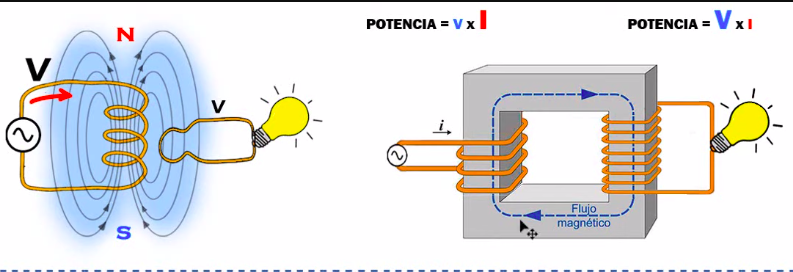

# Transformadores
Los transformadores sirven para modificar la tensión, tanto como aumentar la tensión cómo reducirla. En este Artículo trataré de explicarlo de la forma más detallada posible para que entiendan mejor este componente fundamental para los Electrónicos y Electricistas.

## Ejemplificación
Para comenzar a entender su funcionamiento debemos saber que cuando una **corriente** circula por un **conductor** se genera un campo magnético alrededor.

> Es por eso que los cables eléctricos nunca deben estar cerca de los cables de red, porque causa una interferencia electromagnética sobre los cables de red interfiriendo en la transmisión de datos.

Volviendo a lo anterior, más tarde se dieron cuenta de que si con este conductor creamos un **solenoide**, bobinas, se **unen creando un campo magnético muchísimo mayor**, con un norte y un sur definido como un electroimán.

**Faraday** se dio cuenta que cuando la **espira de un circuito** está dentro del campo magnético no pasa absolutamente nada, esta se mantiene apagada. Sin embargo cuando está en movimiento (dentro del campo magnético) se genera una **tensión y corriente inducida** que prende la lámpara.

Osea el flujo magnético induce un voltaje sobre el circuito que a su vez genera una corriente y que enciende la lámpara, esto solamente pasa cuando la espira está en movimiento, cuando se para no se genera ninguna corriente o tensión inducida.

Lo más importante acá es entender que la **nueva tensión inducida en el circuito de la lámpara no es la misma que la del circuito con la bobina que genera el campo magnético**, es más cuantas y no solo eso, **si aumenta el número de espigas podremos obtener una tensión mayor**, osea el nuevo voltaje depende del número de espigas que tiene el circuito.

Y listo asi podremos modificar cualquier tensión y podremos usarlo a nuestro favor, sin embargo estar moviendo constantemente el circuito genera un gasto de energía, por lo que sería conveniente **mover el campo magnético**. Ahí es donde entra la [Corriente Alterna](https://herediiaa.website/posts/corriente-continua-corriente-alterna/).
En este ejemplo lo vimos con una bateria que es [Corriente Continua](https://herediiaa.website/posts/corriente-continua-corriente-alterna/)
donde la corriente circula en una sola dirección, genera un campo magnético estático con polos definidos. Bien sabemos que la polaridad de **la corriente alterna no es estática sino que va cambiando constantemente**, cada polo va cambiando de positivo a negativo y de negativo a positivo, cambiando tambien la direccion de la corriente y si cambia la dirección cambia la dirección de los polos magnéticos **creando un polo magnético dinámico**, sin gasto alguno siendo muy eficiente.

## Transformador Físico
Ya habiendo entendido la importancia del **campo magnetico dinamica** generado por corriente alterna comencemos a ver los componentes reales de un transformador y como es su funcionamiento.
La **Bobina Primaria** es la que está conectada a la fuente de alimentación (circuito de la izquierda en el ejemplo) y la **Bobina Secundaria** (circuito de la derecha del ejemplo).

Nuestro campo magnético ahora está en el aire aprovechando solo unas cuantas líneas del campo magnético, se pensó **capturar el flujo magnético agregando material ferromagnético**, por lo que se le hace una guia con material ferromagnético así agarramos esas ondas y mejoramos la conducción.

## Relación con la Potencia
Debemos saber que la *fuente* o *generador* que está conectada a la **bobina primaria** nos da una potencia eléctrica que nuestros electrodomésticos necesitan consumir para funcionar. Bien entonces **la potencia que ingresa en el transformador es la misma que sale del transformador** ya que un transformador no genera más electricidad, no genera mas potencia solo la **transforma**.

Pero como? Sabemos que la relación entre la **potencia**, **tensión** y **corriente** es **P = V * I** entonces si en nuestra Bobina Primaria de cuatro espiras tenemos **8V** de entrada con una corriente de **2A** , nuestra potencia es **16W** . Si en mi Bobina Secundaria tengo el doble de espiras voy a tener el doble de tensión **16V** y como la potencia **debe ser la misma de entrada que de salida** nuestra ecuación se **equilibra** para mantener la misma potencia y reduce la corriente a **1A**, lo mismo puede pasar al revez.

De esta manera sencilla funciona el transformador, un elemento super importante en nuestros hogares y el responsable de manejar de abastecer de manera correcta a nuestro electrodomésticos. En próximos artículos hablaré sobre temas relacionados a la **Electricidad**.

